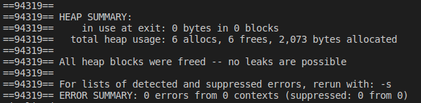

# Exercício 3
### Faça   um   programa   que   armazena   nomes. O   programa   deve armazenar  todos  os  nomes  na  mesma  string.O  tamanho  da  string deve   crescer   e   diminuir   conforme   nomes   forem   colocados   ou removidos. Não pode ter desperdício de memória. Faça o seguinte menu:
1. Adicionar nome 
2. Remover nome 
3. Listar
4. Sair

# Para executar o programa 
~~~Shell
$ ./Executar.sh
~~~

O programa executou corretamente e não apresentou erros no Valgrind

