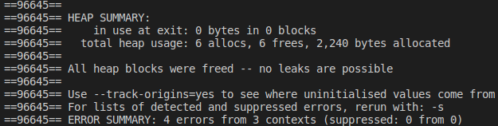

# Exercício 3
### Faça um programa que armazene a informação de várias pessoas. O programa só deve sair quando o usuário disser que não deseja mais entrar com os dados de outra pessoa. Antes de sair o programa deve apresentar, de forma organizada, os dados de todas as pessoas. Use a estrutura que segue:
~~~C
typedef struct{
    char nome[30];
    int idade;
    int altura;
}Pessoa;
~~~

# Para executar o programa 
~~~Shell
$ ./Executar.sh
~~~
O programa executou corretamente, mas apresentou erros no Valgrind, eu acabei não encontrando aonde podeira estar errando.

