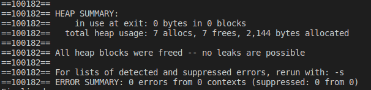

# Exercício 2
### Implementar em C um programa que utilize uma matriz com vetor de ponteiros e que ofereça as seguintes opções para o usuário:
```
a) Criar e redimensionar uma matriz m x n, onde n e m são fornecidos pelo usuário;
b) Realizar a leitura dos elementos da matriz;
c) Fornecer a soma dos elementos da matriz;
d) Retornar em um vetor (utilizando ponteiros) os elementos de uma determinada coluna da matriz;
e) Imprimir a matriz;
f) Sair do programa
```
Observações:
```
1.1) A matriz deve ser alocada dinamicamente no programa por meio do uso da função malloc.
1.2) O programa deve ser modularizado e utilizar os seguintes protótipos de subalgoritmos:
```
~~~C
a. int ** criaMatriz(int m, int n)
b. void leiaMatriz(int **mat, int m, int n)
c. int somaMatriz(int **mat, int m, int n)
d. int* colunaMatriz(int ** mat, int m, int n, int ncoluna)
e. void liberaMatriz(int **mat, int ncoluna)
f. void imprimeMatriz(int **mat, int m, int n)
g. void imprimeVetor (int *vet, int n)
~~~
```
1.3) O subalgoritmo 
```
~~~C 
int* colunaMatriz(int ** mat, int  m, int  n, int ncoluna) 
~~~
```
deve criar um novo vetor (ponteiro para vetor) e retornar o mesmo para o programa principal que será responsável pela impressão dos valores a partir da chamada de 
```
~~~C
void imprimeVet (int *vet, int n) { }
~~~

# Para executar o programa 
```
$ ./Executar.sh
```

O programa executou corretamente e não apresentou erros no Valgrind

