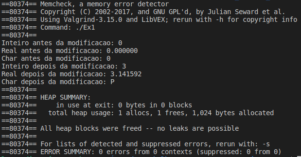

# Exercício 1
### Escreva um programa que declare um inteiro, um real e um char, e ponteiros para inteiro, real, e char. Associe as variáveis aos ponteiros (use &). Modifique os valores de cada variável usando os ponteiros. Imprima os valores das variáveis antes da modificação e após a modificação.

# Para executar o programa 
~~~Shell
$ ./Executar.sh
~~~
O programa executou corretamente e não apresentou erros no Valgrind

