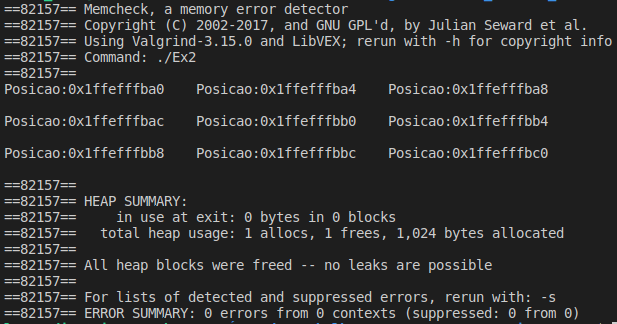

# Exercício 2
### Crie um programa que contenha uma matriz de float contendo 3 linhas e 3 colunas.Imprima o endereço de cada posição dessa matriz.

# Para executar o programa 
~~~Shell
$ ./Executar.sh
~~~
O programa executou corretamente e não apresentou erros no Valgrind

