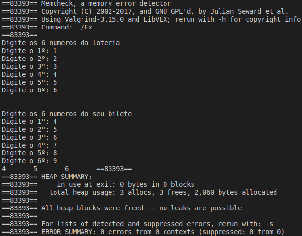

# Exercício 3
### Escreva um programa que leia primeiro os 6 números gerados pela loteria e depois os 6 números do seu bilhete. O programa então compara quantos números o jogador acertou. Em seguida, ele aloca espaço para um vetor de tamanho igual a quantidade de números corretos e guarda os números corretos nesse vetor. Finalmente, o programa exibe os números sorteados e os seus números corretos.

# Para executar o programa 
~~~Shell
$ ./Executar.sh
~~~

O programa executou corretamente e não apresentou erros no Valgrind

