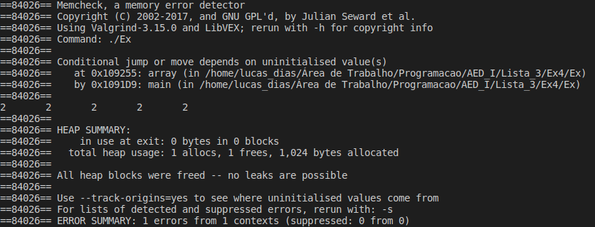

# Exercício 4
### Crie uma função que receba dois parâmetros: um array e um valor do mesmo tipo do array. A função deverá preencher os elementos de array com esse valor. Não utilize índices para percorrer o array, apenas aritmética de ponteiros.

# Para executar o programa 
~~~Shell
$ ./Executar.sh
~~~

O programa executou corretamente, mas apresentou um erro no Valgrind, creio eu que possa ser o modo de como eu estou percorrendo o vetor, mas só consegui encontrar essa forma para percorrer com utilizar índices.

