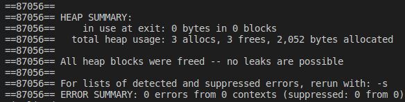

# Exercício 5
### Faça um programa que simule a memória de um computador: o usuário irá especificar o tamanho da memória, ou seja, quantos bytes será ao alocados do tipo inteiro. Para tanto, a memória solicitada deve ser um valor múltiplo do tamanho do tipo inteiro. Em seguida, o usuário terá 2 opções: inserir um valor em uma determinada posição ou consultar o valor contido em uma determinada posição. A memória deve iniciar com todos os dados zerados.

# Para executar o programa 
~~~Shell
$ ./Executar.sh
~~~

O programa executou corretamente e não apresentou erros no Valgrind

