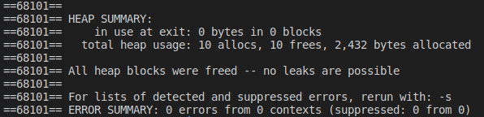

# Exercício 1
### Faça um programa que armazene as informações de várias pessoas(nome e idade) numa pilha.O programa deve possuir um menu
0. Insere pessoa
1. Deleta pessoa do topo
2. Lista pilha 
3. Limpa a pilha
4. Sair do programa

# Para executar o programa 
~~~Shell
$ ./Executar.sh
~~~

O programa executou corretamente e não apresentou erros no Valgrind

