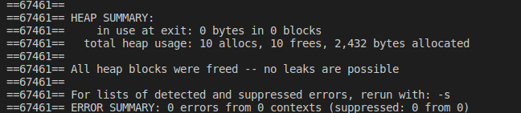

# Exercício 2
### Faça um programa que armazene as informações de várias pessoas(nome e idade) numa lista. O programa deve possuir um menu:
0. Insere pessoa(aqui deve ser passada a posição)
1. Deleta pessoa (informando posição)
2. Deleta pessoa por nome
3. Imprime toda a lista
4. Limpa a lista
5. Sair do programa

# Para executar o programa 
~~~Shell
$ ./Executar.sh
~~~

O programa executou corretamente e não apresentou erros no Valgrind

