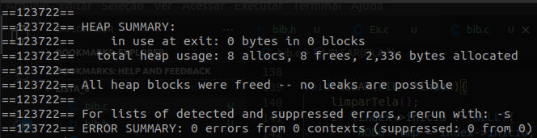

# Exercício 6
### Faça um programa que armazene as informações de várias pessoas(nome e idade) numa fila. O programa deve possuir um menu:
0. Insere pessoa
1. Deleta pessoa
2. Imprime fila
3. Limpa a fila
4. Sair do programa

# Para executar o programa 
~~~Shell
$ ./Executar.sh
~~~

O programa executou corretamente e não apresentou erros no Valgrind

