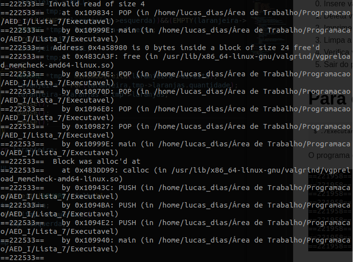

# Exercício 7
### Faça um programa que armazene as informações de várias pessoas(nome e idade) numa árvore binária. O programa deve possuir um menu:
0. Insere valor
1. Deleta valor
2. Imprime árvore
3. Limpa a árvore
4. Verifica valor
5. Sair do programa

# Para executar o programa 
~~~Shell
$ ./Executar.sh
~~~

O programa executou corretamente, mas apresentou erro no Valgrind

Ele aparece logo apos a exclusão de um valor

