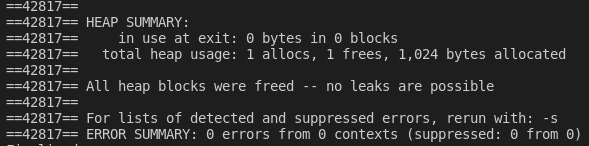

# Exercício 9

1. Implementar os algoritmos de ordenação Insertion Sort e Selection Sort
2. O programa deve solicitar o tamanho do vetor de números (n) que será ordenado
3. O programa deve preencher um vetor de tamanho n com números aleatórios. Usar srand(time(NULL)); no inicio do programa.

# Para executar o programa 
~~~Shell
$ ./Executar.sh
~~~

O programa executou corretamente e não apresentou erro no Valgrind

